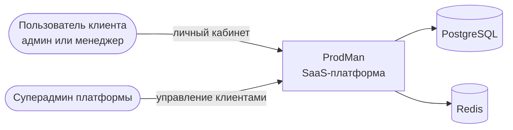
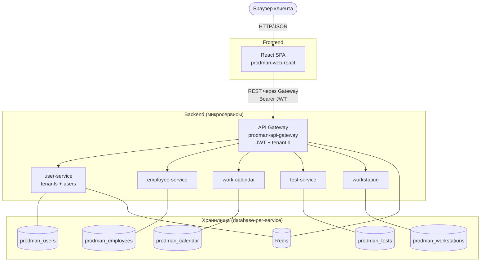
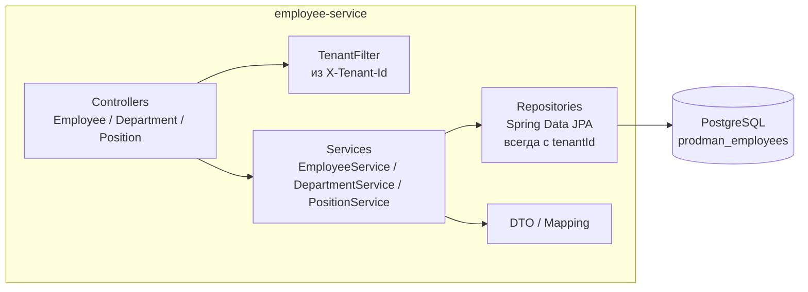
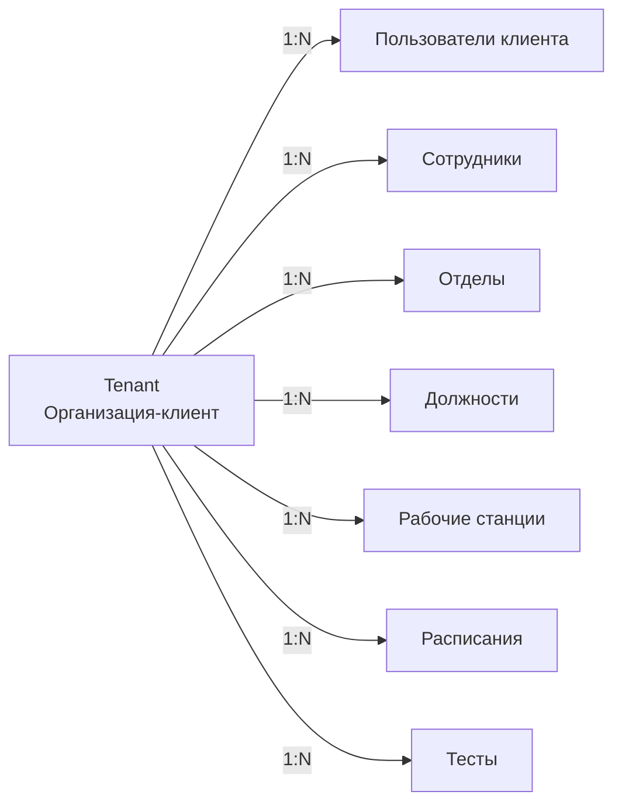

# Архитектура ProdMan

ProdMan — SaaS-приложение: каждая организация-клиент работает в своём изолированном личном кабинете. Все бизнес-данные принадлежат клиенту и разделяются по `tenant_id`.

## Уровень 1. Контекст (C4 Context)

## Уровень 2. Контейнеры (C4 Container)

**Ключевое:** Gateway извлекает `tenantId` из JWT и прокидывает в заголовке (`X-Tenant-Id`) во внутренние сервисы. Сервисы фильтруют данные по `tenantId`.

## Уровень 3. Компоненты (пример: employee-service)

## Модель мультитенантности

Правила:
- У каждой бизнес-сущности — колонка `tenant_id`.
- `tenant_id` **всегда** приходит из JWT, а не из тела запроса.
- Уникальность составная: например, `(tenant_id, code)` для сотрудников, отделов, станций.
- Пользователь видит только данные своего тенанта.

Детали — в [ADR-0002](./adr/0002-multi-tenancy.md).

## Основные потоки

### Регистрация клиента и вход
1. Клиент регистрируется → `user-service` создаёт `Tenant` + первого `User` (admin тенанта).
2. SPA → `POST /api/auth/login` через Gateway.
3. `user-service` валидирует, выдаёт JWT (access + refresh). В токене — `userId`, `tenantId`, `role`.
4. Gateway проверяет JWT на каждом запросе (`JwtAuthenticationFilter`) и добавляет `X-Tenant-Id` во внутренний запрос.
5. SPA хранит токен, шлёт в заголовке `Authorization: Bearer ...`.

### Расстановка сотрудников по станциям (план)
1. SPA запрашивает список сотрудников (`employee-service`) и станций (`workstation`) — только своего тенанта.
2. Менеджер делает назначения.
3. Назначения сохраняются в `work-calendar` (`Schedule` / `EquipmentSchedule`) с `tenant_id`.
4. `work-calendar` рассчитывает часы за месяц и ночные часы.

## Принципы

- Каждый сервис — своя БД (database-per-service).
- Мультитенантность: shared schema + `tenant_id` (см. ADR-0002).
- Общение сервисов через REST (синхронно), позже — возможны события.
- JWT — единственный источник идентичности и `tenantId`.
- Миграции — только через Liquibase, версионируются в `src/main/resources/db/changelog/`.
- Фронт не знает о внутренних адресах сервисов — только Gateway.

## Связанные документы

- [ADR](./adr/) — принятые решения
- [PROJECT.md](../PROJECT.md) — общее описание
- [README.md](../README.md) — быстрый старт