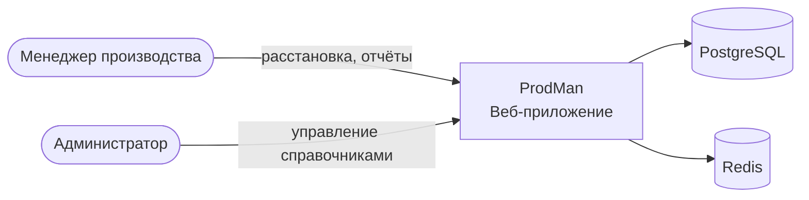
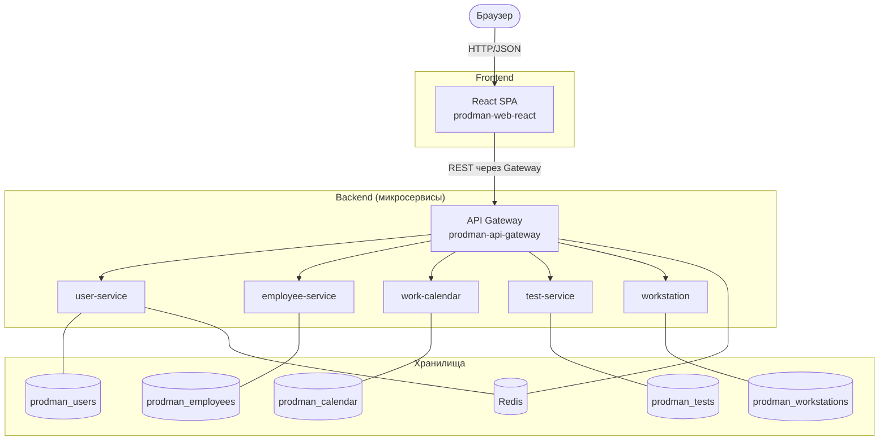
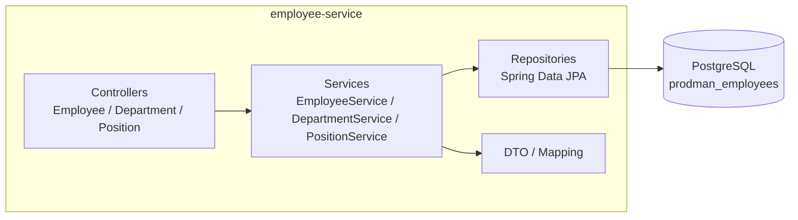

# Архитектура ProdMan

## Уровень 1. Контекст (C4 Context)

## Уровень 2. Контейнеры (C4 Container)

## Уровень 3. Компоненты (пример: employee-service)

## Основные потоки

### Аутентификация
1. SPA → `POST /api/auth/login` через Gateway.
2. `user-service` валидирует, выдаёт JWT (access + refresh).
3. Gateway проверяет JWT на каждом запросе (`JwtAuthenticationFilter`).
4. SPA хранит токен, шлёт в заголовке `Authorization: Bearer ...`.

### Расстановка сотрудников по станциям (план)
1. SPA запрашивает список сотрудников (`employee-service`) и станций (`workstation`).
2. Менеджер делает назначения.
3. Назначения сохраняются в `work-calendar` (Schedule / EquipmentSchedule).
4. `work-calendar` рассчитывает часы за месяц и ночные часы.

## Принципы

- Каждый сервис — своя БД (database-per-service).
- Общение сервисов через REST (синхронно), позже — возможны события.
- JWT — единственный источник идентичности.
- Миграции — только через Liquibase, версионируются в `src/main/resources/db/changelog/`.
- Фронт не знает о внутренних адресах сервисов — только Gateway.

## Связанные документы

- [ADR](./adr/) — принятые решения
- [PROJECT.md](../PROJECT.md) — общее описание
- [README.md](../README.md) — быстрый старт